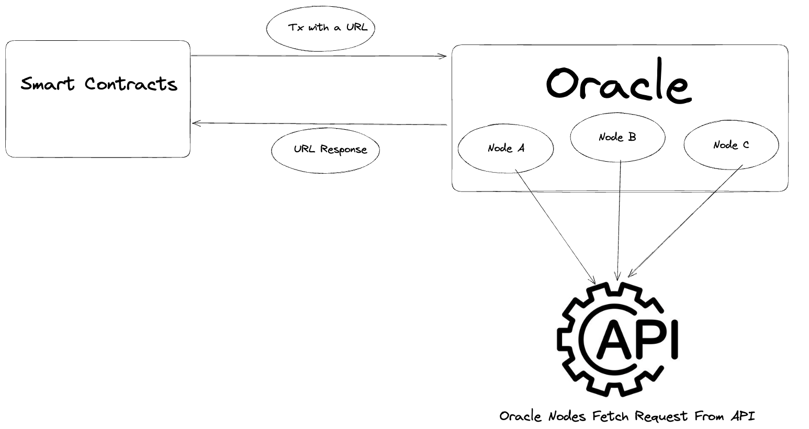

## Data Feeder Oracle

Data Feeder is an oracle deployed on Topos, a fully interoperable blockchain by zero-knowledge proofs. The data feeder will help you to fetch actual world data for your smart contract.Feel free to check our [notion page](https://www.notion.so/Data-Feeder-10698af3252343f6b6975ac2f359afa7)

### Data Feeder Repositories

[Smart Contract Repository](https://github.com/yehia67/data-feeder)

Backend Repository(this one)

Frontend Repository(soon)

### Run & Install

Create `.env` file from `.env.example` and set all variable values

```
cp .env.example .env
```

Install packages using yarn

```
yarn
```

For Dev mode run

```
yarn start:dev
```

For production mode run

```
yarn build && yarn start
```

### Learn More About Oracle



To learn more check [Ethereum Foundation Blog](https://ethereum.org/en/developers/docs/oracles)

### Learn More About Topos

Website: https://toposware.com

Technical Documentation: https://docs.topos.technology

Medium: https://toposware.medium.com

Whitepaper: [Topos: A Secure, Trustless, and Decentralized Interoperability Protocol](https://arxiv.org/pdf/2206.03481.pdf)

## License

This project is released under the terms specified in the [LICENSE](LICENSE) file.
